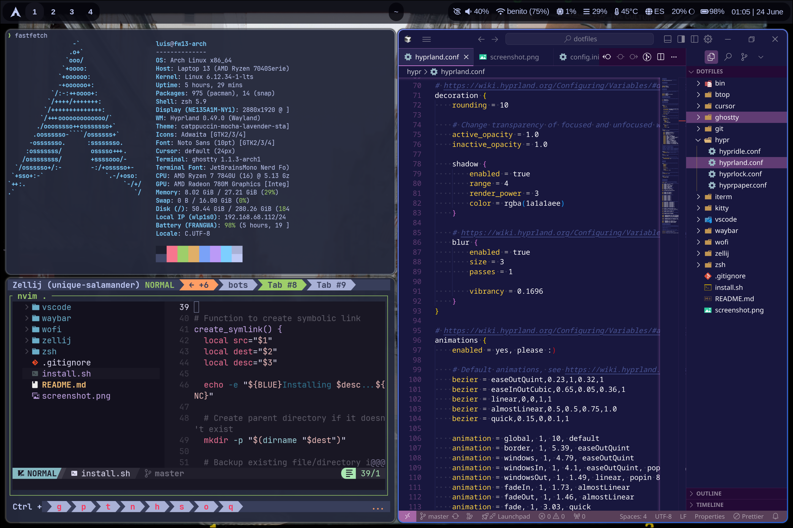

# 🚀 Dotfiles Épicos para ArchLinux

> **Un setup de escritorio moderno y minimalista con Hyprland + Waybar + Kitty**
> *Diseñado para productividad y estética* ✨



## 🌟 Características Principales

### 🎨 **Interfaz Moderna**

- **Hyprland** - Compositor Wayland con animaciones suaves y efectos glassmorphism
- **Waybar** - Barra superior con diseño moderno y módulos informativos
- **Wofi** - Launcher de aplicaciones estilizado con blur y gradientes
- **Kitty** - Terminal rápido con soporte para transparencia y efectos

### 🎯 **Productividad**

- **Zellij** - Multiplexor de terminal con layouts personalizados
- **Fastfetch** - Información del sistema colorida y personalizada
- **BTOp** - Monitor de sistema con tema Tokyo Night
- **Git** - Configuración optimizada para desarrollo

### 🌈 **Tema y Colores**

- **Paleta**: Catppuccin Mocha con acentos cibernéticos
- **Fuentes**: JetBrainsMono Nerd Font, CaskaydiaCove
- **Iconos**: Nerd Fonts con iconos modernos
- **Efectos**: Blur, transparencias, gradientes y sombras

## 🚀 Instalación Rápida

### Método 1: Script Automático (Recomendado)

```bash
# Clonar el repositorio
git clone https://github.com/IsaelFatamaDev/dotfiles.git ~/dev/config/dotfiles

# Ejecutar instalación épica
cd ~/dev/config/dotfiles
./bin/epic-setup
```

### Método 2: Instalación Manual

```bash
# 1. Instalar dependencias básicas
sudo pacman -S hyprland waybar kitty wofi fastfetch btop git zsh

# 2. Instalar AUR helper (yay)
cd /tmp && git clone https://aur.archlinux.org/yay.git
cd yay && makepkg -si

# 3. Instalar paquetes adicionales
yay -S hyprshot wlogout swaylock-effects

# 4. Aplicar configuraciones
cd ~/dev/config/dotfiles
./install.sh
```

## 🎮 Keybinds Principales

### 🪟 **Gestión de Ventanas**

| Teclas | Acción |
|--------|--------|
| `SUPER + Return` | Abrir terminal |
| `SUPER + Q` | Cerrar ventana activa |
| `SUPER + Space` | Launcher de aplicaciones |
| `SUPER + F` | Pantalla completa |
| `SUPER + V` | Ventana flotante |

### 🎨 **Wallpapers y Efectos**

| Teclas | Acción |
|--------|--------|
| `SUPER + W` | Wallpaper aleatorio |
| `SUPER + SHIFT + W` | Selector de wallpapers |
| `SUPER + O` | Toggle transparencia |
| `SUPER + R` | Recargar Hyprland |

### 🖱️ **Navegación**

| Teclas | Acción |
|--------|--------|
| `SUPER + [1-9]` | Cambiar a workspace |
| `SUPER + SHIFT + [1-9]` | Mover ventana a workspace |
| `SUPER + Tab` | Siguiente workspace |
| `ALT + Tab` | Cambiar entre ventanas |

### 📸 **Screenshots**

| Teclas | Acción |
|--------|--------|
| `Print` | Screenshot de pantalla |
| `SHIFT + Print` | Screenshot de región |

## 🛠️ Configuración Personalizada

### 📁 **Estructura de Archivos**

```
dotfiles/
├── hypr/           # Configuración de Hyprland
├── waybar/         # Barra superior + módulos
├── kitty/          # Terminal configuration
├── wofi/           # Launcher de apps
├── fastfetch/      # Info del sistema
├── zsh/            # Shell configuration
├── bin/            # Scripts útiles
└── install.sh      # Script de instalación
```

### 🎨 **Personalizar Temas**

```bash
# Cambiar tema de Waybar
cd ~/.config/waybar
vim style.css

# Personalizar Kitty
cd ~/.config/kitty
vim kitty.conf

# Modificar Hyprland
cd ~/.config/hypr
vim hyprland.conf
```

### 🌈 **Cambiar Colores**

Los archivos de tema principales están en:

- `waybar/mocha.css` - Paleta de colores
- `kitty/current-theme.conf` - Tema de terminal
- `wofi/style.css` - Colores del launcher

## 🔧 Scripts Útiles

### 🖼️ **Wallpaper Switcher**

```bash
# Wallpaper aleatorio
~/dev/config/dotfiles/bin/wallpaper-switcher random

# Selector interactivo
~/dev/config/dotfiles/bin/wallpaper-switcher interactive

# Establecer wallpaper específico
~/dev/config/dotfiles/bin/wallpaper-switcher set /ruta/imagen.jpg
```

### 🚀 **Setup Automático**

```bash
# Instalación completa del entorno
~/dev/config/dotfiles/bin/epic-setup
```

## 📋 Dependencias

### 📦 **Paquetes Oficiales**

```bash
hyprland hyprpaper hypridle hyprlock waybar wofi kitty fastfetch btop
brightnessctl playerctl pavucontrol grim slurp wl-clipboard zsh git
ttf-jetbrains-mono-nerd ttf-fira-code noto-fonts pipewire wireplumber
```

### 🔧 **AUR Packages**

```bash
hyprshot wlogout swaylock-effects nwg-look swaync
```

## 🎯 Características Avanzadas

### ✨ **Efectos Visuales**

- **Blur dinámico** en ventanas y barras
- **Transparencias** configurables
- **Animaciones suaves** para transiciones
- **Sombras** y gradientes modernos
- **Glassmorphism** en elementos UI

### 🎮 **Productividad**

- **Workspaces dinámicos** con animaciones
- **Ventanas flotantes** inteligentes
- **Resize automático** de ventanas
- **Layouts** predefinidos para desarrollo

### 🔧 **Personalización**

- **Temas modulares** fáciles de cambiar
- **Scripts automatizados** para tareas comunes
- **Configuración por aplicación**
- **Hotkeys personalizables**

## 🆘 Solución de Problemas

### 🐛 **Problemas Comunes**

**Waybar no se muestra:**

```bash
killall waybar && waybar &
```

**Wallpaper no cambia:**

```bash
killall hyprpaper && hyprpaper &
```

**Audio no funciona:**

```bash
systemctl --user restart pipewire pipewire-pulse
```

**Fuentes no se ven bien:**

```bash
fc-cache -fv
```

## 📚 Recursos y Referencias

- [Hyprland Wiki](https://wiki.hyprland.org/)
- [Waybar Documentation](https://github.com/Alexays/Waybar/wiki)
- [Catppuccin Theme](https://catppuccin.com/)
- [ArchLinux Wiki](https://wiki.archlinux.org/)

## 🤝 Contribuciones

¡Las contribuciones son bienvenidas! Si tienes ideas para mejorar el setup:

1. Fork el repositorio
2. Crea una branch para tu feature
3. Commit tus cambios
4. Abre un Pull Request

## 📄 Licencia

Este proyecto está bajo la licencia MIT. Ver `LICENSE` para más detalles.

---

<div align="center">

**¡Hecho con ❤️ para la comunidad ArchLinux!**

*Si te gusta este setup, ¡dale una ⭐ al repo!*

</div>
